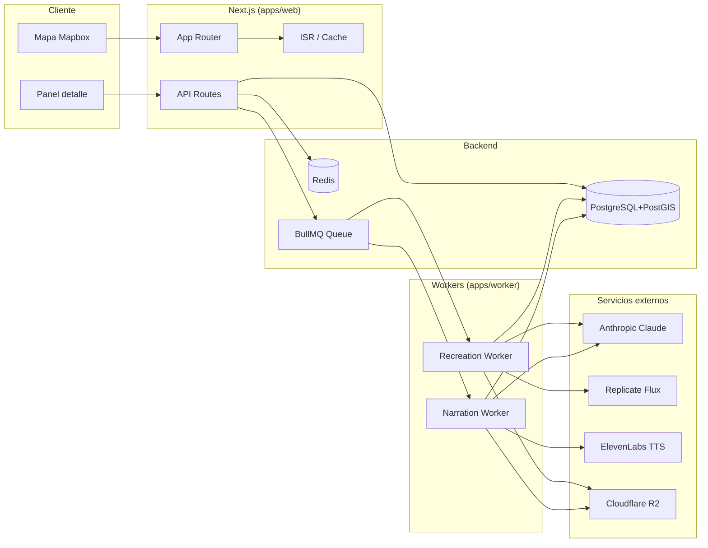

# Chile Histórico

Mapa interactivo de la historia de Chile, con eventos georreferenciados, fuentes
verificadas (Biblioteca Nacional, Memoria Chilena, Archivo Nacional) y
recreaciones generadas por IA cuando no existen registros visuales históricos.

## Stack

- **Framework** Next.js 14 (App Router) · TypeScript estricto
- **DB** PostgreSQL 16 + PostGIS · Prisma 5
- **Cache / colas** Redis 7 · BullMQ
- **Auth** NextAuth v5 (Google OAuth + email)
- **Mapas** Mapbox GL JS 3 · supercluster
- **IA texto** Anthropic Claude (`claude-haiku-4-5`)
- **IA imagen** Replicate (Flux Schnell por defecto)
- **Storage** Cloudflare R2 (S3-compatible)
- **TTS** ElevenLabs (opcional)
- **Estado** Zustand + TanStack Query v5
- **UI** shadcn/ui + Tailwind 3
- **Tests** Vitest + Playwright

## Estructura del monorepo

```
chile-historico/
├── apps/
│   ├── web/                # Next.js 14 (frontend + API routes)
│   └── worker/             # BullMQ workers (recreations + narrations)
├── packages/
│   ├── db/                 # Prisma schema + cliente compartido
│   ├── ai/                 # Wrappers Claude / Replicate / R2 / TTS
│   ├── ui/                 # Componentes shadcn compartidos
│   └── ingest/             # Scripts ingesta + seed inicial (20 eventos)
├── docker/
│   ├── Dockerfile.web
│   ├── Dockerfile.worker
│   └── postgres-init/
│       └── 01-postgis.sql
├── docker-compose.yml          # Postgres + Redis para dev local
├── docker-compose.coolify.yml  # Producción detrás de Traefik
└── .github/workflows/          # ci.yml, docker.yml, deploy.yml
```

## Quick start (dev local)

Prerequisitos: Node 20.x, pnpm 9.x, Docker.

```bash
# 1. Clonar e instalar
pnpm install

# 2. Variables de entorno
cp .env.example .env
# Edita .env con al menos: NEXTAUTH_SECRET, NEXT_PUBLIC_MAPBOX_TOKEN

# 3. Levantar Postgres + Redis
docker compose up -d

# 4. Aplicar migraciones (incluye PostGIS)
pnpm db:migrate:deploy

# 5. Cargar 20 eventos curados
pnpm seed

# 6. Levantar dev server
pnpm dev
# http://localhost:3000

# (opcional) Worker BullMQ en otra terminal
pnpm worker
```

## Arquitectura



## Variables de entorno principales

Ver `.env.example` para lista completa. Las críticas para arrancar son:

| Variable | Obligatoria | Notas |
|---|---|---|
| `DATABASE_URL` | sí | Postgres + PostGIS |
| `REDIS_URL` | sí | BullMQ + cache |
| `NEXTAUTH_SECRET` | sí | `openssl rand -base64 32` |
| `NEXT_PUBLIC_MAPBOX_TOKEN` | sí | Visualizar mapa |
| `ANTHROPIC_API_KEY` | no* | * Modo mock si falta |
| `REPLICATE_API_TOKEN` | no* | * Modo mock si falta |
| `R2_*` | no* | * Sirve data:URL si falta (dev) |
| `GOOGLE_CLIENT_ID` / `_SECRET` | no | Para login OAuth |
| `ELEVENLABS_API_KEY` | no | Sin TTS si falta |

## Comandos útiles

```bash
pnpm dev              # Dev server Next.js
pnpm worker           # Workers BullMQ
pnpm build            # Build de todos los paquetes + web
pnpm test             # Vitest unit
pnpm test:e2e         # Playwright e2e (requiere `pnpm dev` corriendo)
pnpm lint             # ESLint
pnpm type-check       # tsc --noEmit en todo el monorepo
pnpm db:migrate       # Crear migración (dev)
pnpm db:migrate:deploy   # Aplicar migraciones (prod)
pnpm db:studio        # Prisma Studio
pnpm seed             # Cargar 20 eventos curados
pnpm seed -- --reset  # Borrar y reseedear
```

## Deployment

Ver [`COOLIFY_DEPLOY.md`](./COOLIFY_DEPLOY.md) para pasos detallados de despliegue
en Coolify detrás de Traefik con SSL automático vía Cloudflare/Let's Encrypt.

## Roadmap

- [ ] Ingestor real BNDigital (OAI-PMH)
- [ ] Scraper Memoria Chilena (con respeto a robots.txt)
- [ ] Editor visual de coordenadas en formulario contribuir
- [ ] Sistema de revisiones lado-a-lado en panel curaduría
- [ ] Crowdsourced corrections con sistema de votos
- [ ] Mapas temáticos por era / región
- [ ] Línea de tiempo con eventos como hitos visuales
- [ ] Modo "tour" automático

## Contribuir

Lee [`CONTRIBUTING.md`](./CONTRIBUTING.md). Tanto contribuciones técnicas como
históricas son bienvenidas.

## Licencia y atribuciones

Código bajo MIT. El contenido histórico (eventos, descripciones, fuentes) está
sujeto a las licencias de sus repositorios de origen — principalmente Biblioteca
Nacional de Chile y Memoria Chilena. Las recreaciones IA son **interpretativas**
y se identifican como tales en cada uso.
